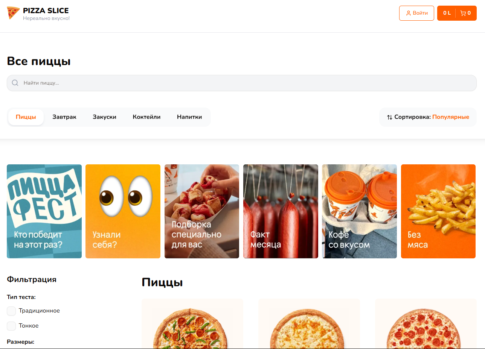
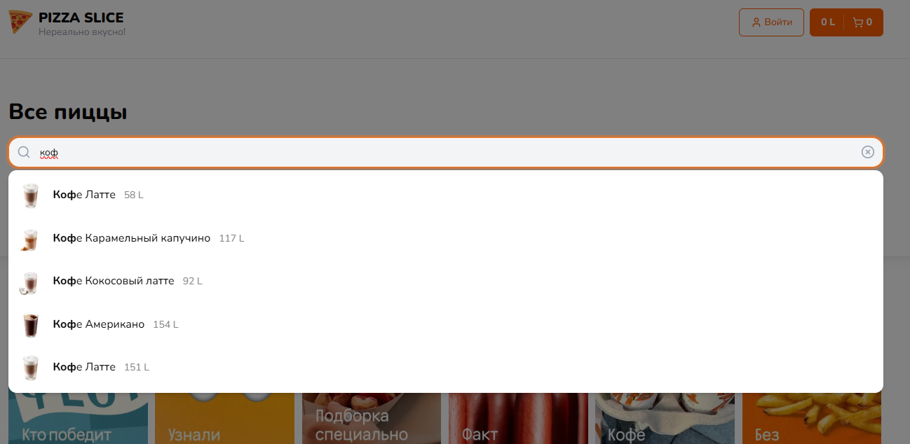
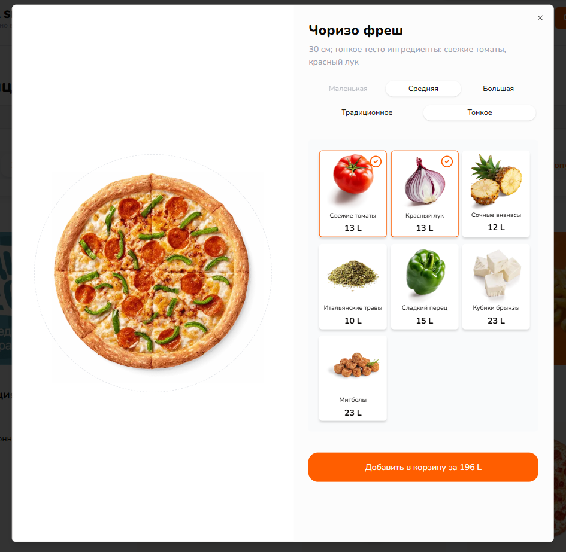
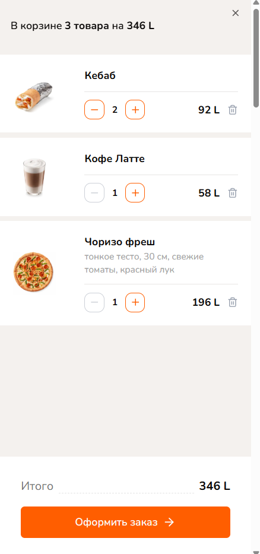
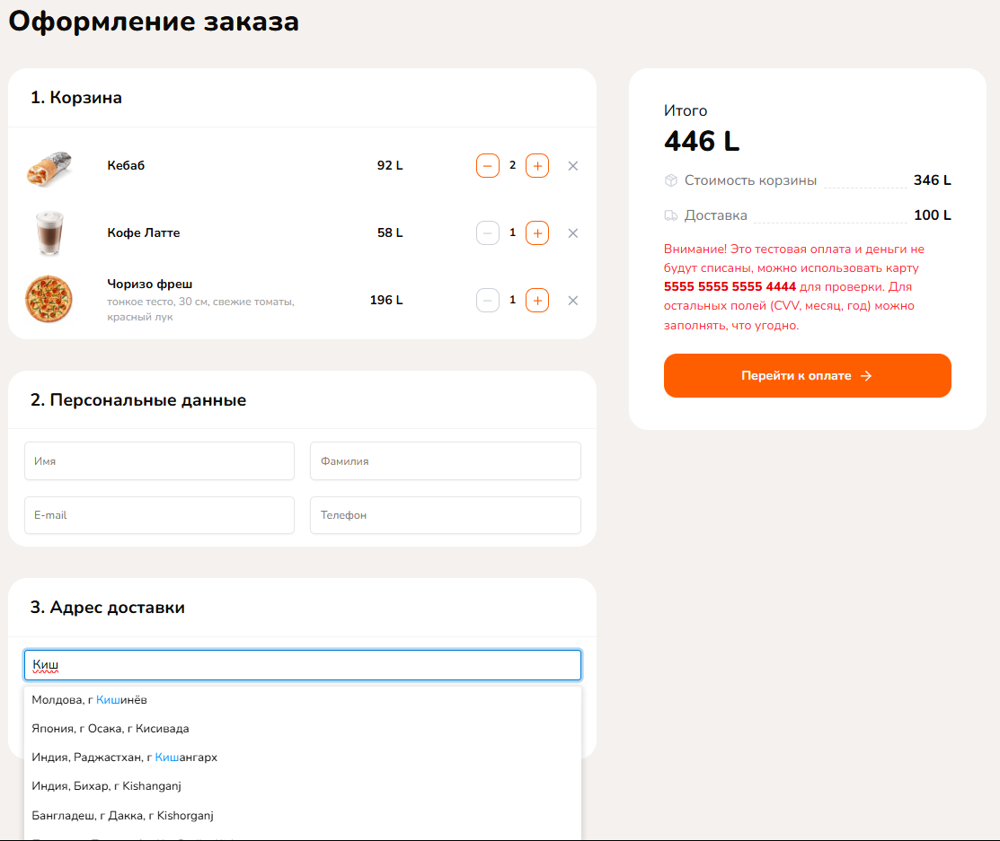
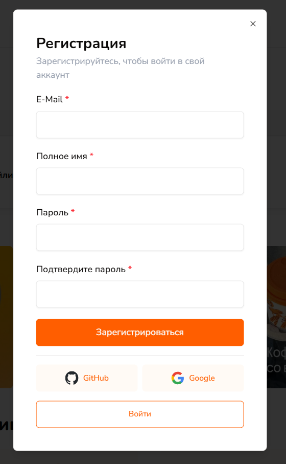
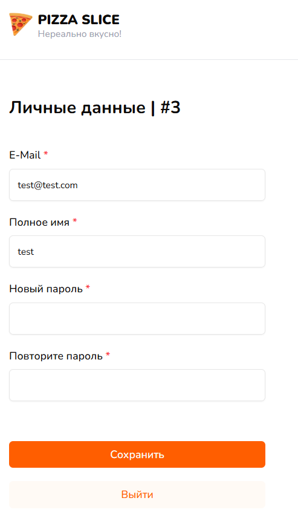

# Pizza Slice 🌐

## Previews:

## Welcome! 👋

### Project Overview 🛒
Pizza Slice is a full-featured e-commerce web application built with cutting-edge technologies to deliver a seamless shopping experience. The project combines the power of Next.js with a robust backend and modern UI components to create a high-performance online store.

### Key Features ✨
- Next.js 14 with App Router architecture

- Type-safe development with TypeScript

- Beautiful UI with TailwindCSS and ShadCN components

- Full-stack capabilities with API routes and Server Actions

- Authentication via NextAuth

- Database integration with Prisma and PostgreSQL

- State management with Zustand

- Form handling with React Hook Form and Zod validation

- Engaging UX with stories, toasts, and loading indicators

### Technology Stack 🛠️
Core Framework
Next.js 15 - Leveraging:

- Parallel Routes for complex layouts

- Route Groups for organized routing

- Server Actions for efficient data mutations

- API routes for backend functionality

- TypeScript - Ensuring type safety throughout the application

- Styling & UI - TailwindCSS Utility-first CSS framework

- ShadCN - Beautiful, accessible UI components built with Radix

- Database & ORM Prisma - Next-generation Node.js ORM

- PostgreSQL - Powerful relational database

- NextAuth - Complete authentication solution

- React Hook Form - Performant form management

- Zod - TypeScript-first schema validation

- Zustand - Lightweight state management solution

- react-use - Collection of essential React hooks

- nextjs-toploader - Elegant loading indicator

- react-hot-toast - Beautiful notifications

- react-insta-stories - Instagram-style stories component

- lucide-react - Beautiful SVG icons

- Resend - Email sending service

## Development Setup 💻
Clone the repository

Install dependencies: npm install

Set up environment variables (.env)

Run the development server: npm run dev

Open http://localhost:3000 in your browser
